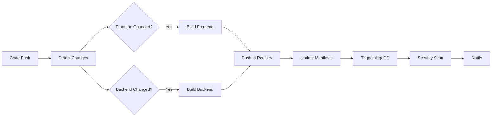

# 🔧 GitHub Actions Setup Guide

This guide helps you configure the GitHub Actions CI/CD pipeline for the authentication stack.

## 📋 Prerequisites

- GitHub repository with Actions enabled
- Kubernetes cluster access
- ArgoCD installed (optional, for GitOps)

## 🔐 Required Secrets

The GitHub Actions workflow requires the following secrets to be configured in your repository:

### Repository Secrets
Go to: `Settings` → `Secrets and variables` → `Actions` → `New repository secret`

| Secret Name | Description | Required | Example |
|-------------|-------------|----------|---------|
| `GITHUB_TOKEN` | Automatically provided by GitHub | ✅ | (Auto-generated) |
| `ARGOCD_TOKEN` | ArgoCD API token for sync | ❌ | `eyJhbGciOiJIUzI1NiIsInR5cCI6IkpXVCJ9...` |
| `ARGOCD_SERVER` | ArgoCD server URL | ❌ | `https://argocd.yourdomain.com` |

### Optional Secrets (for advanced features)
| Secret Name | Description | Example |
|-------------|-------------|---------|
| `SLACK_WEBHOOK` | Slack notification webhook | `https://hooks.slack.com/services/...` |
| `DOCKER_HUB_TOKEN` | Docker Hub access token | `dckr_pat_...` |
| `KUBECONFIG` | Kubernetes cluster config | `apiVersion: v1...` |

## 🏗️ Container Registry Setup

The workflow uses GitHub Container Registry (GHCR) by default, which requires no additional setup. Images are pushed to:
- Frontend: `ghcr.io/chingnokas/vendor2025-app/frontend`
- Backend: `ghcr.io/chingnokas/vendor2025-app/backend`

### Enable GitHub Container Registry
1. Go to your repository settings
2. Navigate to `Actions` → `General`
3. Under "Workflow permissions", select "Read and write permissions"
4. Check "Allow GitHub Actions to create and approve pull requests"

## 🔄 ArgoCD Integration (Optional)

To enable automatic ArgoCD sync after successful builds:

### 1. Get ArgoCD Token
```bash
# Login to ArgoCD CLI
argocd login your-argocd-server.com

# Create a token
argocd account generate-token --account ci-cd --id ci-cd-token
```

### 2. Add Secrets to GitHub
- `ARGOCD_TOKEN`: The token from step 1
- `ARGOCD_SERVER`: Your ArgoCD server URL (e.g., `https://argocd.yourdomain.com`)

### 3. Update Workflow (Optional)
Uncomment the ArgoCD sync section in `.github/workflows/ci.yml`:

```yaml
# Example using curl to ArgoCD API
curl -X POST \
  -H "Authorization: Bearer ${{ secrets.ARGOCD_TOKEN }}" \
  -H "Content-Type: application/json" \
  "${{ secrets.ARGOCD_SERVER }}/api/v1/applications/auth-stack/sync" \
  -d '{"prune": false, "dryRun": false, "strategy": {"hook": {"force": false}}}'
```

## 🧪 Testing the Pipeline

### 1. Test Frontend Changes
```bash
# Make a small change to trigger the pipeline
echo "// Pipeline test $(date)" >> src/main.ts
git add src/main.ts
git commit -m "test: trigger frontend CI/CD pipeline"
git push origin main
```

### 2. Test Backend Changes
```bash
# Make a small change to trigger the pipeline
echo "// Pipeline test $(date)" >> backend/src/index.js
git add backend/src/index.js
git commit -m "test: trigger backend CI/CD pipeline"
git push origin main
```

### 3. Monitor Pipeline
1. Go to your repository on GitHub
2. Click on the "Actions" tab
3. Watch the workflow run in real-time
4. Check the logs for any errors

## 📊 Pipeline Features

### ✅ What the Pipeline Does

1. **Change Detection**: Only builds components that have changed
2. **Multi-Architecture Builds**: Supports AMD64 and ARM64
3. **Container Scanning**: Scans images for vulnerabilities with Trivy
4. **Manifest Updates**: Automatically updates Helm values with new image tags
5. **GitOps Integration**: Triggers ArgoCD sync (if configured)
6. **Notifications**: Provides build status and notifications

### 🔍 Pipeline Stages



## 🔧 Customization

### Modify Build Triggers
Edit `.github/workflows/ci.yml` to change when the pipeline runs:

```yaml
on:
  push:
    branches: [ main, develop, staging ]  # Add more branches
    paths:
      - 'src/**'
      - 'backend/**'
      # Add more paths to watch
```

### Change Container Registry
To use a different registry (e.g., Docker Hub):

```yaml
env:
  REGISTRY: docker.io  # Change from ghcr.io
  FRONTEND_IMAGE_NAME: your-username/frontend
  BACKEND_IMAGE_NAME: your-username/backend
```

### Add Notification Channels
Add Slack notifications:

```yaml
- name: 📢 Notify Slack
  if: always()
  uses: 8398a7/action-slack@v3
  with:
    status: ${{ job.status }}
    webhook_url: ${{ secrets.SLACK_WEBHOOK }}
```

## 🚨 Troubleshooting

### Common Issues

#### Permission Denied for Container Registry
**Error**: `denied: permission_denied`

**Solution**: 
1. Check repository permissions in Settings → Actions → General
2. Ensure "Read and write permissions" is selected
3. Verify the `GITHUB_TOKEN` has package write permissions

#### Image Build Failures
**Error**: `failed to solve: failed to read dockerfile`

**Solution**:
1. Check Dockerfile paths in the workflow
2. Ensure Dockerfiles exist in the correct locations
3. Verify build context is correct

#### ArgoCD Sync Failures
**Error**: `connection refused` or `unauthorized`

**Solution**:
1. Verify `ARGOCD_SERVER` URL is correct
2. Check `ARGOCD_TOKEN` is valid and not expired
3. Ensure ArgoCD application exists

### Debug Commands

```bash
# Check workflow runs
gh run list --repo chingnokas/vendor2025-app

# View specific run logs
gh run view <run-id> --repo chingnokas/vendor2025-app

# Check container registry
docker pull ghcr.io/chingnokas/vendor2025-app/frontend:latest
```

## 📚 Additional Resources

- [GitHub Actions Documentation](https://docs.github.com/en/actions)
- [GitHub Container Registry](https://docs.github.com/en/packages/working-with-a-github-packages-registry/working-with-the-container-registry)
- [ArgoCD API Documentation](https://argo-cd.readthedocs.io/en/stable/developer-guide/api-docs/)
- [Docker Multi-Platform Builds](https://docs.docker.com/build/building/multi-platform/)

## 🤝 Contributing

1. Fork the repository
2. Create a feature branch
3. Make your changes
4. Test the pipeline
5. Submit a pull request

The CI/CD pipeline will automatically test your changes! 🚀
