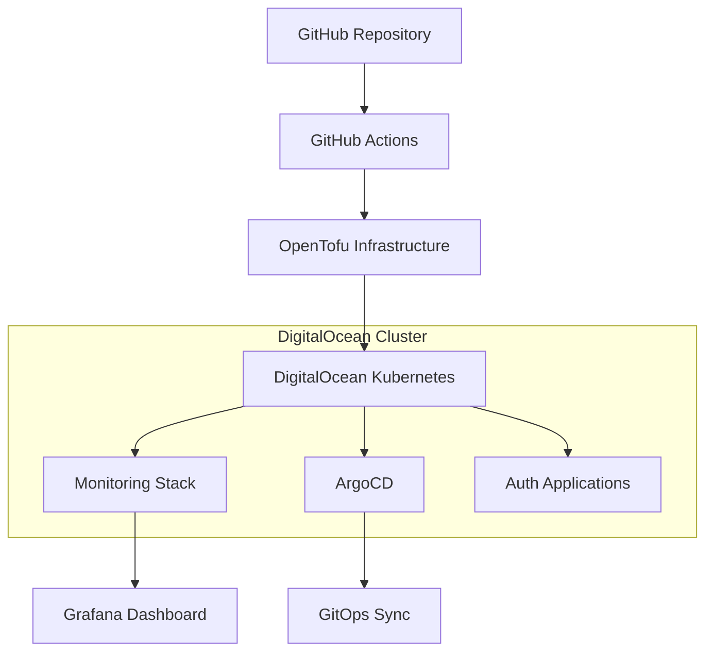

# 🚀 Complete End-to-End Deployment Guide

## 📋 Overview

This guide provides complete instructions for deploying your authentication stack using:
- **OpenTofu** for infrastructure provisioning on DigitalOcean
- **Kubernetes** cluster management
- **Helm** for application deployment
- **ArgoCD** for GitOps continuous deployment
- **Prometheus & Grafana** for monitoring and alerting

## 🏗️ Architecture Overview



## 🔧 Prerequisites

### Required Accounts & Tools
- **DigitalOcean Account** with API access
- **GitHub Repository** with Actions enabled
- **Local Development Environment** with:
  - `kubectl` (v1.28+)
  - `helm` (v3.14+)
  - `git`
  - `doctl` (DigitalOcean CLI)

### Required Secrets
Configure these secrets in your GitHub repository:

| Secret Name | Description | Example |
|-------------|-------------|---------|
| `DIGITALOCEAN_TOKEN` | DigitalOcean API token | `dop_v1_...` |
| `GRAFANA_ADMIN_PASSWORD` | Grafana admin password | `secure-password-123` |

## 🚀 Quick Start Deployment

### Step 1: Configure Environment Variables

Update the production configuration in [`infrastructure/environments/production.tfvars`](infrastructure/environments/production.tfvars):

```hcl
# Replace with your actual office IP for security
ssh_allowed_ips = ["YOUR_OFFICE_IP/32"]

# Adjust cluster size based on your needs
node_count = 3
node_size = "s-4vcpu-8gb"
```

### Step 2: Deploy Infrastructure

Push changes to trigger the infrastructure workflow:

```bash
# Make infrastructure changes
git add infrastructure/
git commit -m "feat: configure production infrastructure"
git push origin main
```

Or manually trigger deployment:
1. Go to **Actions** → **🏗️ Infrastructure CI/CD with OpenTofu**
2. Click **Run workflow**
3. Select environment: `production`
4. Select action: `apply`

### Step 3: Verify Deployment

Monitor the deployment progress:
1. **GitHub Actions**: Check workflow status
2. **DigitalOcean Console**: Verify cluster creation
3. **Local Access**: Download kubeconfig and test

```bash
# Download kubeconfig from GitHub Actions artifacts
# Test cluster access
kubectl --kubeconfig=kubeconfig-production.yaml cluster-info
```

### Step 4: Access Services

Get LoadBalancer IPs:
```bash
kubectl --kubeconfig=kubeconfig-production.yaml get services --all-namespaces
```

Access your services:
- **Grafana**: `http://<GRAFANA_LB_IP>` (admin / your-password)
- **ArgoCD**: `http://<ARGOCD_LB_IP>` (admin / get-password-command)
- **Application**: `http://<APP_LB_IP>`

## 🔄 Workflow Details

### Infrastructure Workflow

**Triggers:**
- Push to `main` with infrastructure changes
- Manual workflow dispatch
- Pull requests (plan only)

**Stages:**
1. **Validate** - OpenTofu format and validation
2. **Plan** - Generate execution plan
3. **Apply** - Provision infrastructure
4. **Deploy Monitoring** - Install Prometheus & Grafana
5. **Deploy ArgoCD** - Setup GitOps
6. **Deploy Applications** - Install auth-stack

### Application Workflow

**Triggers:**
- Push to `main` with application changes
- Infrastructure workflow completion
- Pull requests (build only)

**Stages:**
1. **Build Images** - Frontend & Backend Docker images
2. **Security Scan** - Trivy vulnerability scanning
3. **Deploy** - Update Helm values and sync ArgoCD

## 📊 Monitoring & Alerting

### Grafana Dashboards

Pre-configured dashboards include:
- **Kubernetes Cluster Overview** (GrafanaID: 7249)
- **Node Exporter Metrics** (GrafanaID: 1860)
- **Docker Container Metrics** (GrafanaID: 193)
- **Custom Auth Stack Dashboard**

### Alert Rules

Comprehensive alerting for:
- **Infrastructure**: Node health, resource usage
- **Applications**: Service availability, performance
- **Database**: Connection limits, slow queries
- **Security**: Failed logins, unauthorized access

### Alert Channels

Configure notification channels in Grafana:
1. **Slack** - Team notifications
2. **Email** - Critical alerts
3. **PagerDuty** - Production incidents

## 🔐 Security Configuration

### Network Security
- **Firewall Rules**: Configured via OpenTofu
- **VPC Isolation**: Optional VPC for production
- **LoadBalancer Security**: DigitalOcean managed

### Access Control
- **RBAC**: Kubernetes role-based access
- **ArgoCD Projects**: Restricted repository access
- **Image Security**: Trivy scanning in CI/CD

### Secrets Management
- **GitHub Secrets**: CI/CD credentials
- **Kubernetes Secrets**: Application credentials
- **Helm Values**: Environment-specific configuration

## 🌍 Multi-Environment Setup

### Environment Configurations

| Environment | Cluster Size | Auto-scaling | HA | Monitoring Pool |
|-------------|--------------|--------------|----|-----------------| 
| **Staging** | 2 nodes (s-2vcpu-4gb) | 1-3 nodes | No | No |
| **Production** | 3 nodes (s-4vcpu-8gb) | 2-10 nodes | Yes | Yes |

### Environment-Specific Deployment

**Staging:**
```bash
# Automatic on develop branch
git checkout develop
git push origin develop
```

**Production:**
```bash
# Automatic on main branch
git checkout main
git push origin main
```

**Manual Environment:**
```bash
# Use workflow dispatch
# Select environment: staging/production
# Select action: apply/destroy
```

## 🛠️ Troubleshooting

### Common Issues

#### Infrastructure Deployment Fails
```bash
# Check OpenTofu logs in GitHub Actions
# Verify DigitalOcean token permissions
# Check quota limits
doctl compute quota get
```

#### Application Not Accessible
```bash
# Check pod status
kubectl get pods -n auth-app

# Check service endpoints
kubectl get services -n auth-app

# Check ingress/loadbalancer
kubectl describe service frontend-service -n auth-app
```

#### ArgoCD Sync Issues
```bash
# Check ArgoCD application status
kubectl get applications -n argocd

# Force sync
kubectl patch application auth-stack -n argocd --type merge -p '{"operation":{"sync":{"syncStrategy":{"hook":{"force":true}}}}}'
```

#### Monitoring Not Working
```bash
# Check monitoring pods
kubectl get pods -n monitoring

# Check Prometheus targets
kubectl port-forward -n monitoring svc/monitoring-stack-kube-prometheus-prometheus 9090:9090
# Visit http://localhost:9090/targets
```

### Debug Commands

```bash
# Get cluster info
kubectl cluster-info

# Check all resources
kubectl get all --all-namespaces

# View logs
kubectl logs -f deployment/frontend -n auth-app
kubectl logs -f deployment/backend -n auth-app

# Check events
kubectl get events --sort-by='.lastTimestamp' -n auth-app
```

## 💰 Cost Optimization

### Staging Environment
- **Auto-scaling**: 1-3 nodes based on load
- **Node Size**: s-2vcpu-4gb (cost-effective)
- **No HA**: Single control plane
- **No Monitoring Pool**: Shared resources

### Production Environment
- **Auto-scaling**: 2-10 nodes for reliability
- **Node Size**: s-4vcpu-8gb (performance)
- **HA Enabled**: Multiple control planes
- **Dedicated Monitoring**: Separate node pool

### Cost Monitoring
- **Alerts**: Set up cost threshold alerts
- **Resource Limits**: Configure pod resource limits
- **Cleanup**: Destroy staging environments when not needed

```bash
# Destroy staging environment
# Use workflow dispatch with action: destroy
```

## 🔄 GitOps Workflow

### Code Changes → Deployment

1. **Developer pushes code** to `main` branch
2. **GitHub Actions** builds and pushes images
3. **Workflow updates** Helm values with new image tags
4. **ArgoCD detects** changes in Git repository
5. **ArgoCD syncs** applications to match Git state
6. **Monitoring** tracks deployment health

### Manual Sync

```bash
# Get ArgoCD admin password
kubectl -n argocd get secret argocd-initial-admin-secret -o jsonpath="{.data.password}" | base64 -d

# Port forward to ArgoCD UI
kubectl port-forward svc/argocd-server -n argocd 8080:443

# Access UI at https://localhost:8080
# Username: admin, Password: (from above)
```

## 📈 Scaling & Performance

### Horizontal Scaling
- **Auto-scaling**: Configured per environment
- **Load Balancing**: DigitalOcean LoadBalancers
- **Database**: MariaDB with connection pooling

### Vertical Scaling
- **Resource Requests**: Set appropriate CPU/memory
- **Resource Limits**: Prevent resource starvation
- **Node Sizing**: Choose appropriate DigitalOcean droplet sizes

### Performance Monitoring
- **Response Times**: 95th percentile < 1 second
- **Error Rates**: < 5% error rate threshold
- **Resource Usage**: < 80% CPU/memory utilization

## 🔧 Maintenance

### Regular Tasks
- **Security Updates**: Monitor and apply patches
- **Certificate Renewal**: Automated via cert-manager
- **Backup Verification**: Test database backups
- **Cost Review**: Monthly cost analysis

### Upgrade Procedures
- **Kubernetes**: Use DigitalOcean managed upgrades
- **Applications**: GitOps-based rolling updates
- **Monitoring**: Helm chart upgrades
- **Infrastructure**: OpenTofu state management

## 📚 Additional Resources

### Documentation
- [OpenTofu Documentation](https://opentofu.org/docs/)
- [DigitalOcean Kubernetes](https://docs.digitalocean.com/products/kubernetes/)
- [ArgoCD Documentation](https://argo-cd.readthedocs.io/)
- [Prometheus Monitoring](https://prometheus.io/docs/)

### Support
- **GitHub Issues**: Report bugs and feature requests
- **DigitalOcean Support**: Infrastructure issues
- **Community**: Kubernetes and ArgoCD communities

---

## 🎉 Success Checklist

After deployment, verify:

- [ ] ✅ **Infrastructure**: Kubernetes cluster running
- [ ] ✅ **Applications**: Frontend and backend accessible
- [ ] ✅ **Database**: MariaDB operational
- [ ] ✅ **Monitoring**: Grafana dashboards working
- [ ] ✅ **GitOps**: ArgoCD syncing applications
- [ ] ✅ **Alerts**: Prometheus alerts configured
- [ ] ✅ **Security**: Trivy scans passing
- [ ] ✅ **CI/CD**: GitHub Actions workflows successful

**Your complete end-to-end deployment is now ready! 🚀**

---

*For questions or issues, check the troubleshooting section or create a GitHub issue.*