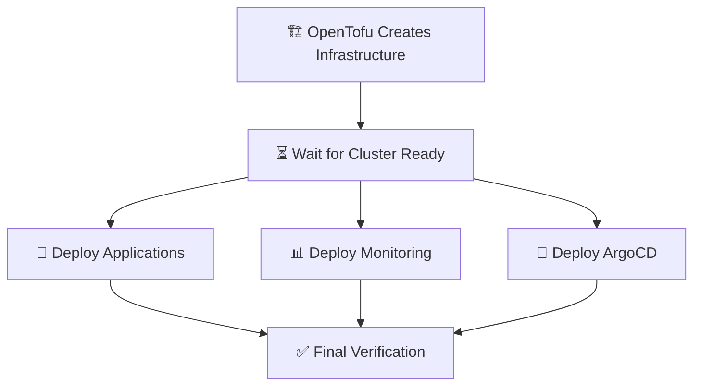

# 🚀 **Deployment Architecture Overview**

## 📋 **Where Each Component is Deployed**

### **🏗️ Infrastructure (OpenTofu)**
**Location:** Job 1 - `infrastructure`
**What:** Creates DigitalOcean Kubernetes cluster
**Namespace:** N/A (Infrastructure level)
**Files Used:**
- `infrastructure/main.tf`
- `infrastructure/variables.tf` 
- `infrastructure/outputs.tf`

```yaml
# Creates:
- Kubernetes Cluster (auth-stack-staging/production)
- Worker Nodes (2x s-2vcpu-4gb for staging, 3x s-4vcpu-8gb for production)
- Load Balancers
- Block Storage
```

---

### **🎯 Applications (Helm Charts)**
**Location:** Job 3 - `deploy-applications`
**What:** Your auth-stack application (Frontend + Backend + Database)
**Namespace:** `auth-app`
**Files Used:**
- `helm/auth-stack/` (entire Helm chart)
- `helm/auth-stack/values.yaml`
- `helm/auth-stack/templates/`

```yaml
# Deployment Command:
helm upgrade --install auth-stack helm/auth-stack \
  --namespace auth-app \
  --create-namespace \
  --set monitoring.enabled=true \
  --set environment="staging" \
  --wait \
  --timeout 8m

# Creates:
- Frontend Pod (Angular app)
- Backend Pod (Express.js API)
- MariaDB Pod (Database)
- Services for each component
- ConfigMaps and Secrets
- ServiceMonitors (for Prometheus)
```

---

### **📊 Monitoring (Prometheus + Grafana)**
**Location:** Job 4 - `deploy-monitoring`
**What:** Monitoring stack with Prometheus and Grafana
**Namespace:** `monitoring`
**Files Used:**
- `helm/monitoring-stack/Chart.yaml`
- `helm/monitoring-stack/values.yaml`
- `helm/monitoring-stack/dashboards/`

```yaml
# Deployment Command:
helm upgrade --install monitoring-stack helm/monitoring-stack \
  --namespace monitoring \
  --create-namespace \
  --wait \
  --timeout 10m

# Creates:
- Prometheus Server (metrics collection)
- Grafana Server (dashboards)
- AlertManager (notifications)
- Node Exporter (system metrics)
- ServiceMonitors (scrape configs)
- Pre-configured dashboards
```

---

### **🔄 ArgoCD (GitOps) - TO BE ADDED**

Let me create an ArgoCD deployment job:

**Location:** Job 5 - `deploy-argocd` (to be added)
**What:** GitOps continuous deployment
**Namespace:** `argocd`
**Purpose:** Pull-based deployment from Git repository

```yaml
# What ArgoCD will do:
- Monitor your Git repository for changes
- Automatically sync Helm charts when you push changes
- Provide GitOps workflow for continuous deployment
- Web UI for managing deployments
- Rollback capabilities
```

---

## 🔄 **Deployment Flow**



### **Timeline:**
1. **Infrastructure** (5-8 min) - OpenTofu creates cluster
2. **Wait for Ready** (2-3 min) - Ensures cluster is operational
3. **Parallel Deployment** (8-12 min):
   - Applications deploy immediately when cluster ready
   - Monitoring deploys in parallel
   - ArgoCD deploys in parallel
4. **Verification** (1-2 min) - Confirms everything works

---

## 📁 **File Structure**

```
project/
├── infrastructure/                 # OpenTofu Infrastructure
│   ├── main.tf
│   ├── variables.tf
│   └── outputs.tf
├── helm/
│   ├── auth-stack/                # Application Helm Chart
│   │   ├── Chart.yaml
│   │   ├── values.yaml
│   │   └── templates/
│   │       ├── frontend.yaml
│   │       ├── backend.yaml
│   │       ├── database.yaml
│   │       └── servicemonitor.yaml
│   └── monitoring-stack/          # Monitoring Helm Chart
│       ├── Chart.yaml
│       ├── values.yaml
│       └── dashboards/
└── .github/workflows/
    ├── full-stack-deploy.yml     # Main deployment workflow
    ├── destroy-cluster.yml       # Cleanup workflow
    └── test-now.yml             # Testing workflow
```

---

## 🎯 **Access Points After Deployment**

### **🎯 Applications**
```bash
# Access your auth application
kubectl port-forward -n auth-app svc/frontend-service 8080:8080
# URL: http://localhost:8080
```

### **📊 Monitoring**
```bash
# Access Grafana dashboards
kubectl port-forward -n monitoring svc/monitoring-stack-grafana 3001:80
# URL: http://localhost:3001
# Username: admin
# Password: admin123

# Access Prometheus
kubectl port-forward -n monitoring svc/monitoring-stack-prometheus 9090:9090
# URL: http://localhost:9090
```

### **🔄 ArgoCD (When Added)**
```bash
# Access ArgoCD UI
kubectl port-forward -n argocd svc/argocd-server 8080:443
# URL: https://localhost:8080
# Username: admin
# Password: (from ArgoCD secret)
```

---

## 🔧 **How to Add ArgoCD**

To add ArgoCD for GitOps pull-based deployment, we need to:

1. **Add ArgoCD job** to the workflow
2. **Configure ArgoCD Application** to monitor your Git repo
3. **Set up auto-sync** for continuous deployment

Would you like me to:
1. **Add ArgoCD to the existing workflow?**
2. **Create a separate ArgoCD setup workflow?**
3. **Show you how to configure GitOps applications?**

---

## 💡 **Current Status**

✅ **Working:** Infrastructure + Applications + Monitoring
⏳ **To Add:** ArgoCD for GitOps pull-based deployment

The current workflow uses **push-based deployment** (GitHub Actions pushes to cluster).
Adding ArgoCD will enable **pull-based deployment** (ArgoCD pulls from Git).

**Both approaches can work together for a complete CI/CD + GitOps solution!**
