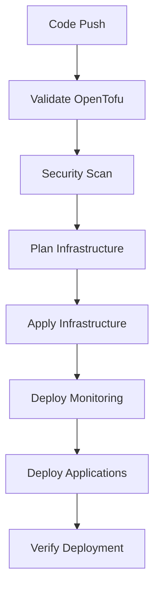

# 🏗️ **OpenTofu CI/CD Integration Guide**

## 🎯 **Overview**

This guide shows how OpenTofu is integrated into your CI/CD pipeline for automated infrastructure management. Your pipeline now supports:

- **Infrastructure as Code** with OpenTofu
- **Multi-environment deployments** (staging/production)
- **Automated cluster provisioning** on DigitalOcean
- **Complete application deployment** after infrastructure is ready

---

## 🚀 **Quick Start**

### **1. Local Development**

```bash
# Deploy complete stack locally
./deploy-full-stack.sh staging

# Or manage infrastructure separately
./manage-infrastructure.sh plan staging
./manage-infrastructure.sh apply staging
```

### **2. CI/CD Pipeline**

The pipeline automatically triggers on:
- **Push to main** - Deploys to staging
- **Manual workflow dispatch** - Deploy to any environment
- **Infrastructure changes** - Validates and plans changes

---

## 🔄 **CI/CD Workflow Overview**

### **Pipeline Stages:**



### **Workflow Files:**

| File | Purpose | Triggers |
|------|---------|----------|
| `.github/workflows/infrastructure-ci.yml` | Infrastructure management | Infrastructure changes |
| `.github/workflows/monitoring-ci.yml` | Monitoring deployment | Monitoring changes |
| `.github/workflows/frontend-ci.yml` | Application deployment | App code changes |

---

## 🏗️ **Infrastructure Configuration**

### **Environment Structure:**

```
infrastructure/
├── main.tf                    # Main infrastructure definition
├── variables.tf               # Variable definitions
├── outputs.tf                 # Output definitions
└── environments/
    ├── staging.tfvars         # Staging configuration
    └── production.tfvars      # Production configuration
```

### **Environment Configurations:**

**Staging:**
- 2 nodes, s-2vcpu-4gb
- Auto-scaling: 1-3 nodes
- Cost-optimized

**Production:**
- 3 nodes, s-4vcpu-8gb
- Auto-scaling: 2-10 nodes
- High availability

---

## 🔧 **Manual Infrastructure Management**

### **Local Commands:**

```bash
# Plan changes
./manage-infrastructure.sh plan staging

# Apply changes
./manage-infrastructure.sh apply production

# Check status
./manage-infrastructure.sh status staging

# Destroy infrastructure
./manage-infrastructure.sh destroy staging
```

### **Direct OpenTofu Commands:**

```bash
cd infrastructure

# Initialize
tofu init

# Plan with environment file
tofu plan -var-file="environments/staging.tfvars"

# Apply
tofu apply -var-file="environments/staging.tfvars"

# Destroy
tofu destroy -var-file="environments/staging.tfvars"
```

---

## 🔄 **CI/CD Pipeline Details**

### **1. Validation Stage**

```yaml
validate:
  - Format check (tofu fmt)
  - Configuration validation (tofu validate)
  - Security scanning (tfsec)
```

### **2. Planning Stage**

```yaml
plan:
  - Creates execution plan
  - Shows resource changes
  - Uploads plan artifact
  - Comments on PR with plan
```

### **3. Apply Stage**

```yaml
apply:
  - Downloads plan artifact
  - Applies infrastructure changes
  - Exports kubeconfig
  - Uploads kubeconfig artifact
```

### **4. Application Deployment**

```yaml
deploy-apps:
  - Downloads kubeconfig
  - Deploys monitoring stack
  - Deploys auth-stack application
  - Verifies deployment
```

---

## 🔐 **Security & Secrets Management**

### **Required GitHub Secrets:**

| Secret | Purpose | Example |
|--------|---------|---------|
| `DIGITALOCEAN_TOKEN` | DigitalOcean API access | `dop_v1_...` |

### **Security Features:**

- ✅ **State file encryption** (when using remote backend)
- ✅ **Secret scanning** with tfsec
- ✅ **Container image scanning** with Trivy
- ✅ **RBAC** for environment protection
- ✅ **Manual approval** for production deployments

---

## 🌍 **Multi-Environment Support**

### **Environment Protection:**

```yaml
# Production requires manual approval
environment: 
  name: production
  url: https://cloud.digitalocean.com/kubernetes/clusters
```

### **Environment Variables:**

```bash
# Staging
TF_VAR_cluster_name="auth-stack-staging"
TF_VAR_node_count=2
TF_VAR_node_size="s-2vcpu-4gb"

# Production
TF_VAR_cluster_name="auth-stack-production"
TF_VAR_node_count=3
TF_VAR_node_size="s-4vcpu-8gb"
```

---

## 📊 **Monitoring Integration**

### **Infrastructure Monitoring:**

The pipeline automatically deploys monitoring for:
- **Cluster metrics** (CPU, memory, disk)
- **Application metrics** (HTTP requests, response times)
- **Infrastructure costs** (node usage, storage)

### **Alerting:**

```yaml
# Example alert rules
- alert: ClusterNodeDown
  expr: up{job="kubernetes-nodes"} == 0
  for: 5m
  
- alert: HighInfrastructureCost
  expr: digitalocean_monthly_cost > 100
  for: 1h
```

---

## 🔄 **GitOps Integration**

### **ArgoCD Sync:**

```yaml
# ArgoCD automatically syncs when:
- Infrastructure changes are applied
- Application images are updated
- Configuration changes are made
```

### **Workflow Integration:**

1. **Code Push** → Infrastructure validation
2. **Infrastructure Apply** → Cluster ready
3. **Application Deploy** → Apps running
4. **ArgoCD Sync** → GitOps alignment

---

## 🛠️ **Troubleshooting**

### **Common Issues:**

**Pipeline fails at planning:**
```bash
# Check OpenTofu configuration
tofu validate
tofu fmt -check
```

**Infrastructure apply fails:**
```bash
# Check DigitalOcean token
echo $DIGITALOCEAN_TOKEN

# Check quota limits
doctl compute quota get
```

**Cluster not accessible:**
```bash
# Download kubeconfig from artifacts
# Test connectivity
kubectl --kubeconfig=kubeconfig-staging.yaml cluster-info
```

### **Debugging Commands:**

```bash
# Check pipeline logs
gh run list --workflow=infrastructure-ci.yml

# Download artifacts
gh run download <run-id>

# Check infrastructure state
./manage-infrastructure.sh status staging
```

---

## 📈 **Cost Optimization**

### **Automated Cost Management:**

```yaml
# Staging auto-shutdown (optional)
schedule:
  - cron: '0 18 * * 1-5'  # Shutdown weekdays at 6 PM
    action: destroy
  - cron: '0 8 * * 1-5'   # Start weekdays at 8 AM
    action: apply
```

### **Resource Optimization:**

- **Auto-scaling** reduces costs during low usage
- **Spot instances** for non-critical workloads
- **Resource limits** prevent over-provisioning
- **Monitoring alerts** for cost thresholds

---

## 🎯 **Best Practices**

### **Infrastructure Code:**

- ✅ **Version control** all infrastructure code
- ✅ **Environment separation** with tfvars files
- ✅ **Resource tagging** for cost tracking
- ✅ **State file backup** and encryption
- ✅ **Plan before apply** always

### **CI/CD Pipeline:**

- ✅ **Manual approval** for production
- ✅ **Rollback capability** with previous plans
- ✅ **Monitoring integration** from day one
- ✅ **Security scanning** at every stage
- ✅ **Cost alerts** and optimization

---

## 🎉 **Benefits Achieved**

- 🏗️ **Infrastructure as Code** - Repeatable, version-controlled infrastructure
- 🚀 **Automated Deployments** - From code to running application in minutes
- 🔄 **GitOps Workflow** - Git as single source of truth
- 📊 **Comprehensive Monitoring** - Full observability from infrastructure to application
- 💰 **Cost Optimization** - Auto-scaling and resource management
- 🔒 **Security First** - Scanning, secrets management, and RBAC

**Your infrastructure pipeline is now production-ready and follows industry best practices!** 🎊
